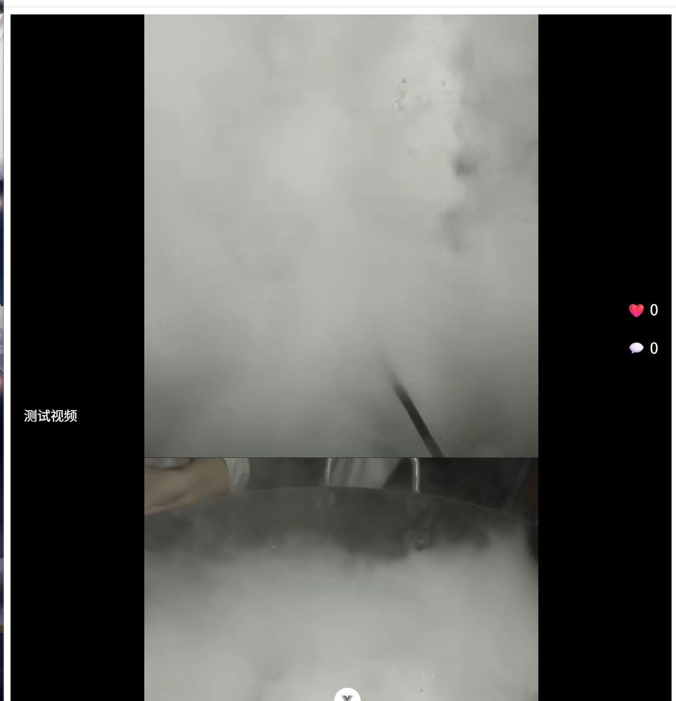

<div align="center">


# 微澜 VidWave

基于 SpringBoot + Vue3 的短视频信息流应用

</div>

## 📖 项目介绍

微澜（VidWave）是一个从零独立开发的全栈短视频信息流应用。  
项目以抖音核心交互为蓝本，逐步迭代，旨在展示 **Java 全栈开发、高并发缓存、异步处理、推荐算法** 等能力。

### 当前阶段（阶段一）
- ✅ MySQL 数据库设计
- ✅ SpringBoot RESTful API（视频列表分页查询）
- ✅ 阿里云 OSS 存储视频/封面
- ✅ Vue3 + Vite 前端搭建
- ✅ 全屏沉浸式纵向滑动（Swiper.js）
- ✅ 视频自动播放与切换控制
- ✅ 前后端分离跨域处理

### 后续规划
- 阶段二：用户登录、点赞评论（JWT + Redis）
- 阶段三：视频上传与转码（FFmpeg + 消息队列）
- 阶段四：推荐系统与 Elasticsearch 搜索
- 阶段五：AI 智能搜索（大模型 API + 向量检索）

## 🛠️ 技术栈

| 层级     | 技术                          |
| -------- | ----------------------------- |
| 后端框架 | SpringBoot 3.x, MyBatis-Plus  |
| 数据库   | MySQL                         |
| 缓存     | Redis（待接入）               |
| 对象存储 | 阿里云 OSS                    |
| 前端框架 | Vue 3 (Composition API), Vite |
| 滑动组件 | Swiper.js 11                  |
| 部署     | Nginx, Docker（待接入）       |

## 📁 项目结构

```
VidWave/
├── vidwave-server/          # 后端 SpringBoot 项目
│   ├── src/main/java/com/vidwave/
│   │   ├── controller/      # 接口控制器
│   │   ├── entity/          # 数据库实体
│   │   └── mapper/          # MyBatis-Plus Mapper
│   └── src/main/resources/
│       └── application.example.yml  # 配置文件模板
├── vidwave-web/             # 前端 Vue 项目
│   ├── src/
│   │   ├── api/             # 接口请求封装
│   │   ├── App.vue          # 主组件（滑动列表）
│   │   └── main.js
│   └── package.json
└── README.md
```

## 🚀 本地运行

### 环境要求
- JDK 17+
- MySQL 8.0+
- Maven 3.8+
- Node.js 18+

### 后端启动
1. 导入 `vidwave-server` 到 IDEA
2. 修改 `application.example.yml` 为 `application.yml`，填入你的数据库信息
3. 执行 `VidwaveServerApplication.main()`

### 前端启动
1. 进入 `vidwave-web` 目录
2. `npm install`
3. `npm run dev`
4. 打开 `http://localhost:5173`

## 📸 效果演示



## 📝 许可证

MIT License

---

**从微澜开始，终成浪潮。**